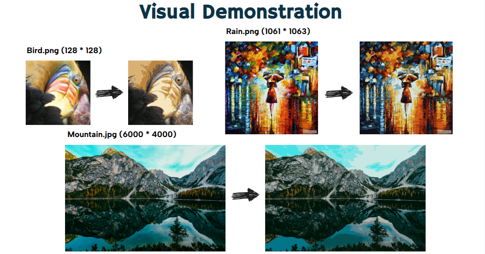

This is our final project for NTU 2025 Parallel Programming course, focusing on accelerating K-means image color quantization using OpenMP, MPI, and CUDA.

### Environment (On NCHC)
* Create a Miniconda Environment
```sh
module load miniconda3
conda create -n FINAL -c conda-forge opencv pkg-config -y
conda activate FINAL
```
* Load the required modules for the program
```sh
module load gcc/13
module load openmpi
module load cuda
export PKG_CONFIG_PATH=$CONDA_PREFIX/lib/pkgconfig:$PKG_CONFIG_PATH
export LD_LIBRARY_PATH=$CONDA_PREFIX/lib:$LD_LIBRARY_PATH
```
### Compilation
* sequential.cc
```sh
g++ sequential.cc -o output -O3 -std=c++17 $(pkg-config --cflags --libs opencv4)
```
* OpenMP.cc
```sh
g++ OpenMP.cc -O3 -fopenmp -o output $(pkg-config --cflags --libs opencv4)
```
* MPI.cc
```sh
mpicxx MPI.cc -o output -O3 -std=c++17 \
-L$CONDA_PREFIX/lib \
-Wl,-rpath-link,$CONDA_PREFIX/lib \
$(pkg-config --cflags --libs opencv4)
```
* cuda.cu
```sh
nvcc cuda.cu -o cuda \
    -O3 -std=c++17 -arch=sm_70 \
    -Xcompiler -D_GLIBCXX_USE_CXX11_ABI=0 \
    $(pkg-config --cflags --libs opencv4)
```
### Execution
```sh
./output <input_image_path> <output_image_path> <n color vectors>
```
### Acknowledgements
This project uses code from the following repository:
- Repository: [https://github.com/Aftaab99/ImageColorQuantization](https://github.com/Aftaab99/ImageColorQuantization?tab=readme-ov-file)
- File(s) used: KMeansCompressv2.cc, bird_small.png, rain_princess.png
- License: MIT License


